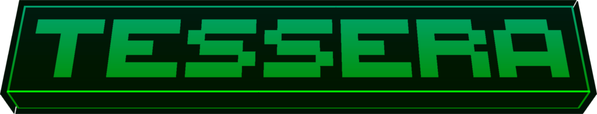

<div align="center">

# 

[](https://neoforged.net/)
[](https://modrinth.com/mod/tesseras)
[](https://www.curseforge.com/minecraft/mc-mods/tessera)
[](#license)

**A GPU-first VRAM optimization engine for NeoForge 1.21.1**

**Compresses texture atlases to BC7 in place, animations included, with a native encoder and a pure-Java fallback.**
</div>

---

## Overview

**Tessera** compresses Minecraft's texture atlases into the GPU-native **BC7** block format right after vanilla uploads
them, cutting atlas VRAM by up to **75%** with no perceptible visual change. It is aimed at low-end and integrated GPUs
running texture-heavy modpacks.

The atlas keeps its texture, UVs and rendering path: only its storage format changes, so chunk meshing, lighting,
shaders and other mods are untouched.

> In **early development**. Feedback and bug reports are very welcome.

## Features

### 🧩 In-place BC7 compression

- Every atlas, including the block atlas, is re-encoded to BC7 after vanilla's upload, with its full mip chain.
- Encoding runs on a background thread; only the GPU upload happens on the render thread, so reloads don't freeze the
  game.
- Fully transparent texels are colour-bled before encoding, so cutout and GUI textures get no white/grey fringes.
- A content-addressed disk cache (`tessera-cache/`, size-capped, least-recently-used eviction) skips re-encoding
  unchanged atlases on the next launch.

### 🌊 Animated textures keep animating

- Water, lava, fire and every other animated sprite stay animated on the compressed atlas: each frame is written as BC
  blocks with `glCompressedTexSubImage2D`.
- Keyframes are encoded once and cached; interpolated frames are encoded on the fly.
- At the smallest mip levels, where a sprite is smaller than a 4×4 block, only the affected blocks are patched and
  re-encoded.

### ⚡ Native encoder with a safe fallback

- A bundled native encoder ([bc7enc_rdo](https://github.com/richgel999/bc7enc_rdo)) is loaded over JNI: no launch flags,
  works on Java 21+.
- Bundled for **Windows x86_64**, **Linux x86_64** and **Linux AArch64** (glibc 2.17+).
- On any other platform, or if the native library fails to load, Tessera switches to its pure-Java encoder. It never
  crashes the game because of the native layer.

### 📊 F3 debug overlay

- Live VRAM savings per atlas in the debug HUD.

### 🔌 Compression event API

- `AtlasCompressEvent.Pre` (cancellable; lets you choose BC7 or BC1 per atlas) and `AtlasCompressEvent.Post` (bytes
  saved and resident), fired on `NeoForge.EVENT_BUS`.

## Benchmarks

#### Vanilla:

<div align="center">


</div>

#### Heavy modpack (**All The Mods 10**):

<div align="center">


</div>

- Up to **75% less** texture-atlas VRAM.
- BC7 is near-lossless for typical Minecraft textures.
- Savings grow with atlas count and resolution.

> Results depend on resource packs, installed mods and atlas composition.

## Installation & Requirements

| Requirement   | Version                                                                       |
|---------------|-------------------------------------------------------------------------------|
| Minecraft     | `1.21.1`                                                                      |
| Mod loader    | [NeoForge](https://neoforged.net/) `21.1.x`                                   |
| Java          | `21+`                                                                         |
| Dependency    | [Celeris](https://github.com/PanzerDevOrg/Celeris) `0.1.0+`                   |
| GPU           | BC7 support (`GL_ARB_texture_compression_bptc`, any OpenGL 4.2+ GPU)          |
| Native encoder| Windows x86_64, Linux x86_64 / AArch64; other platforms use the Java encoder  |
| macOS         | Not supported (OpenGL 4.1, no BC7)                                            |

1. Install NeoForge for Minecraft 1.21.1.
2. Put **Tessera** and **Celeris** in your `mods/` folder.
3. Launch the game. There is nothing else to set up.

> Tessera is **client-side only**; servers don't need it.

## ⚡ Maximum performance (optional JVM flags)

Tessera and Celeris work out of the box. A few JVM flags unlock Celeris's fastest code paths (SIMD math used by
Tessera's atlas analysis, plus off-heap memory and native zstd on Java 21):

| Minecraft (Java)       | Add to your JVM arguments                                                              |
|------------------------|----------------------------------------------------------------------------------------|
| 1.21.x (Java 21)       | `--enable-preview --add-modules=jdk.incubator.vector --enable-native-access=ALL-UNNAMED` |
| 26.x and up (Java 25+) | `--add-modules=jdk.incubator.vector --enable-native-access=ALL-UNNAMED`                 |

Where to put them: **Modrinth App** → instance → *Settings → Java and memory → Java arguments*; **CurseForge App** →
*Settings → Minecraft → Additional arguments*; **Prism Launcher** → instance → *Settings → Java → JVM arguments*.

Without flags nothing breaks: each feature falls back to a pure-Java path. Use `--enable-preview` only with the
Java 21 that Minecraft 1.21.x ships with.

## Configuration

`config/tessera-client.toml` (also editable from the in-game mod settings screen):

| Option                     | Default         | Effect                                                         |
|----------------------------|-----------------|----------------------------------------------------------------|
| `compressionQuality`       | `4`             | Native BC7 quality preset, `0` (fastest) to `7` (best)          |
| `disableNativeCompression` | `false`         | Turns all compression off; atlases stay vanilla RGBA8          |
| `vramBudgetTargetMb`       | `2048`          | Budget used when the GPU's VRAM can't be queried                |
| `cacheDirectory`           | `tessera-cache` | Disk cache folder, relative to the game directory              |

The disk cache size limit defaults to 512 MB; change it with `-Dtessera.cache.maxMB=<MB>`.

## Developer Guide

Bug reports and PRs are welcome. Please open an issue first for larger changes.

- **Bugs:** [GitHub Issues](https://github.com/PanzerDevOrg/Tessera/issues). Include Minecraft/NeoForge/Tessera
  versions, GPU, OS and your log.

### Setup

Clone the shared build logic next to Tessera; the build reads it from `../panzer-build-logic`:

```bash
git clone https://github.com/PanzerDevOrg/PanzerBuildLogic.git panzer-build-logic
git clone https://github.com/PanzerDevOrg/Tessera.git
```

Celeris is resolved from your local Maven repository (if you `publishToMavenLocal` it yourself) or from
`https://panzerdevorg.github.io/Celeris/maven`.

Requirements: **JDK 21**. Gradle comes with the wrapper.

### Build and run

```bash
./gradlew :1.21.1:build        # compile + test
./gradlew :1.21.1:runClient    # dev client
./gradlew :1.21.1:runData      # regenerate lang files (src/generated/resources)
./gradlew buildAndCollect      # release jar in build/libs/<version>/
```

### Native encoder

The JNI library is built from `native/` (CMake) against the vendored bc7enc_rdo sources:

```bash
cd native/vendor/bc7enc_rdo && ./fetch.sh && cd ../../..   # vendor the pinned upstream sources

# Windows x86_64 (Visual Studio + CMake)
cmake -S native -B build-native/windows -A x64
cmake --build build-native/windows --config Release
mkdir -p natives/windows/x86_64 && cp build-native/windows/Release/tessera_bridge.dll natives/windows/x86_64/

# Linux x86_64 + AArch64 (Docker, from any OS)
JAVA_HOME=<path to a JDK> ./native/build-linux.sh
```

The prebuilt binaries are committed under `natives/<os>/<arch>/` so they can be inspected. CI rebuilds all three from
`native/` on every push (`.github/workflows/package.yml`) and bundles those fresh builds into the released jar; you
only need to rebuild them locally when changing `native/`.

### Releases, changelogs and the Modrinth page

Everything published outside GitHub lives in [`docs/`](./docs): one changelog per version in
`docs/changelogs/<version>.md`, and the Modrinth page in `docs/modrinth/description.md` (synced on every push to
`master`). See [`docs/README.md`](./docs/README.md) for the release steps.

### Project layout

```
docs/                   # changelogs/, modrinth/, media/ (see docs/README.md)
native/
  CMakeLists.txt        # JNI library build
  build-linux.sh        # Linux x86_64 + aarch64 build in Docker
  vendor/bc7enc_rdo/    # tessera_bridge.cpp + fetch.sh (upstream sources are fetched, not committed)
src/main/java/com/panzer/mods/tessera/
  api/                  # AtlasCompressEvent
  atlas/                # Atlas assembly, mip chains, compression/upload driver
  cache/                # Disk cache
  compress/             # Pipeline, animated-frame uploader, JNI + pure-Java encoders
  config/               # Config and rules
  gui/                  # F3 debug overlay
  mixin/                # TextureAtlas and SpriteContents hooks
  vram/                 # VRAM budget
```

## License

| Content                             | License                                                                                                     |
|-------------------------------------|-------------------------------------------------------------------------------------------------------------|
| Source code (Java, C++)             | [AGPL-3.0-only](https://www.gnu.org/licenses/agpl-3.0.html) — see [`LICENSE-AGPL`](./LICENSE-AGPL)          |
| Artwork, logos, and branding assets | [CC BY-NC-SA 4.0](https://creativecommons.org/licenses/by-nc-sa/4.0/) — see [`LICENSE-CC`](./LICENSE-CC)    |
| Vendored bc7enc_rdo                 | MIT / public domain — see [`native/vendor/bc7enc_rdo/LICENSE`](./native/vendor/bc7enc_rdo/LICENSE)          |

**Source code:** you may study, modify and redistribute it under the AGPL; if you run a modified version as a network
service, its source must be available to that service's users.

**Artwork:** credit Panzer, no commercial use without permission, and share derivatives under the same license.

See [`LICENSE`](./LICENSE) for the full summary.

---

<div align="center">


Made by **[Panzer](https://github.com/PanzerDevOrg)** - **[Bichal](https://github.com/Bichal)**

[](https://modrinth.com/mod/tesseras)
[](https://www.curseforge.com/minecraft/mc-mods/tessera)
[](https://github.com/PanzerDevOrg/Tessera/issues)

</div>
