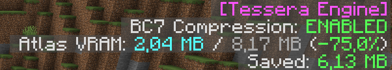
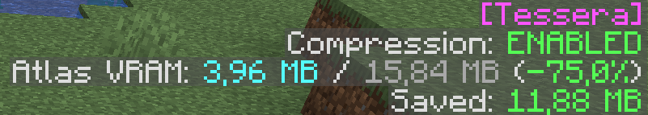

<!-- publish:off -->
[](https://neoforged.net/)
[](https://modrinth.com/mod/tesseras)
[](https://www.curseforge.com/minecraft/mc-mods/tessera)
[](#license)
<!-- publish:on -->

**Tessera makes Minecraft use less video memory.** It shrinks the game's textures on your graphics card by up to
75%, and the game looks exactly the same. Helpful with big resource packs, large modpacks, or a GPU without much
memory.

- Nothing to set up: install it and play.
- Water, lava, fire and every other animated texture keep moving.
- No freezes while textures load; the work happens in the background.
- Doesn't change how the game draws, so shaders and other visual mods keep working.
- Press F3 to see how much video memory it saves (on every version except 1.21.5 – 1.21.9).

> **You also need [Celeris](https://github.com/PanzerDevOrg/Celeris).** Put both in your `mods` folder.

## Before and after

| Version 0.1 (old) | Version 0.2 (new) |
|:---:|:---:|
|  |  |

The number in the corner is the video memory saved. The more textures your packs and mods add, the more it saves.

## Will it work for me?

- **Minecraft** 1.21 – 1.21.11 and 26.1 – 26.3, on NeoForge. Download the file made for your version.
- **Windows or Linux.** Macs can't use it: macOS doesn't support the texture format Tessera needs.
- **Your computer only.** Servers don't need it, and you can join any server with it.

## Learn more

Settings, extra speed tips, how it works and the full version list are on GitHub.

<p align="center">
<a href="https://github.com/PanzerDevOrg/Tessera"></a>
<a href="https://github.com/PanzerDevOrg/Celeris"></a>
<a href="https://github.com/PanzerDevOrg/Tessera/issues"></a>
<a href="https://github.com/PanzerDevOrg/Tessera/tree/master/docs/changelogs"></a>
</p>

<!-- publish:off -->

## Files per version

| Minecraft | Tessera file |
|---|---|
| 1.21 – 1.21.4 | `tessera-<version>+1.21.1.jar` |
| 1.21.5 – 1.21.10 | `tessera-<version>+1.21.10.jar` |
| 1.21.11 | `tessera-<version>+1.21.11.jar` |
| 26.1 – 26.3 | `tessera-<version>+26.1.jar` |

## JVM flags (optional)

Tessera works without any setup. These JVM flags unlock Celeris's fastest code paths:

| Minecraft (Java) | Add to your JVM arguments |
|---|---|
| 1.21.x (Java 21) | `--enable-preview --add-modules=jdk.incubator.vector --enable-native-access=ALL-UNNAMED` |
| 26.x and up (Java 25+) | `--add-modules=jdk.incubator.vector --enable-native-access=ALL-UNNAMED` |

Where to put them:

- **Modrinth App**: instance → *Settings → Java and memory → Java arguments*
- **CurseForge App**: *Settings → Minecraft → Additional arguments*
- **Prism Launcher**: instance → *Settings → Java → JVM arguments*

Without the flags nothing breaks; each feature uses its pure-Java fallback. Use `--enable-preview` only with the Java 21
that Minecraft 1.21.x ships with.

## Configuration

In the in-game mod settings, or `config/tessera-client.toml`:

| Option | Default | Effect |
|---|---|---|
| `compressionQuality` | `4` | BC7 quality preset, `0` (fastest) to `7` (best) |
| `disableNativeCompression` | `false` | Turns compression off; atlases stay vanilla |
| `vramBudgetTargetMb` | `2048` | Budget used when the GPU's VRAM can't be detected |
| `cacheDirectory` | `tessera-cache` | Disk cache folder, relative to the game directory |

The disk cache is capped at 512 MB; change it with `-Dtessera.cache.maxMB=<MB>`.

## For developers

`AtlasCompressEvent.Pre` (cancellable; choose BC7 or BC1 per atlas) and `AtlasCompressEvent.Post` (bytes saved and
resident) are fired on `NeoForge.EVENT_BUS`.

Source code, issues and docs: **[github.com/PanzerDevOrg/Tessera](https://github.com/PanzerDevOrg/Tessera)**

## How it works

- Every atlas is re-encoded to BC7 after vanilla's upload, with its full mip chain. Encoding runs on a background
  thread; only the GPU upload happens on the render thread.
- Fully transparent texels are colour-bled before encoding, so cutout and GUI textures get no fringes.
- A content-addressed disk cache (`tessera-cache/`, size-capped, least-recently-used eviction) skips re-encoding
  unchanged atlases.
- Animated sprites are written as BC blocks with `glCompressedTexSubImage2D`: keyframes are encoded once and cached,
  interpolated frames on the fly; at mip levels smaller than a 4×4 block only the affected blocks are patched.
- The native encoder ([bc7enc_rdo](https://github.com/richgel999/bc7enc_rdo)) is loaded over JNI (no launch flags),
  bundled for Windows x86_64, Linux x86_64 and Linux AArch64 (glibc 2.17+). Anywhere else, or if it fails to load,
  the pure-Java encoder takes over.

## Developer guide

Bug reports and PRs are welcome; please open an issue first for larger changes.
[GitHub Issues](https://github.com/PanzerDevOrg/Tessera/issues): include Minecraft/NeoForge/Tessera versions, GPU, OS
and your log.

### Setup

Clone the shared build logic next to Tessera; the build reads it from `../panzer-build-logic`:

```bash
git clone https://github.com/PanzerDevOrg/PanzerBuildLogic.git panzer-build-logic
git clone https://github.com/PanzerDevOrg/Tessera.git
```

Celeris is resolved from your local Maven repository (if you `publishToMavenLocal` it yourself) or from
`https://panzerdevorg.github.io/Celeris/maven`. Requirements: **JDK 21**.

### Build and run

```bash
./gradlew :1.21.1:build        # compile + test
./gradlew :1.21.1:runClient    # dev client
./gradlew :1.21.1:runData      # regenerate lang files (src/generated/resources)
./gradlew buildAndCollect      # release jars (universal, per-system, sources) in build/libs/<version>/
```

### Native encoder

The JNI library is built from `native/` (CMake) against the vendored bc7enc_rdo sources:

```bash
cd native/vendor/bc7enc_rdo && ./fetch.sh && cd ../../..   # vendor the pinned upstream sources

# Windows x86_64 (Visual Studio + CMake)
cmake -S native -B build-native/windows -A x64
cmake --build build-native/windows --config Release
mkdir -p natives/windows/x86_64 && cp build-native/windows/Release/tessera_bridge.dll natives/windows/x86_64/

# Linux x86_64 + AArch64 (Docker, from any OS)
JAVA_HOME=<path to a JDK> ./native/build-linux.sh
```

The prebuilt binaries are committed under `natives/<os>/<arch>/`. CI rebuilds all three from `native/` on every push
and bundles those fresh builds into the released jars.

### Releases and descriptions

This README is also the description on Modrinth and CurseForge (everything outside `publish:off` blocks). Changelogs
live in `docs/changelogs/<version>.md`; see [`docs/README.md`](./docs/README.md) for the release steps and previews.

### Project layout

```
docs/                   # changelogs/, media/ (see docs/README.md)
native/
  CMakeLists.txt        # JNI library build
  build-linux.sh        # Linux x86_64 + aarch64 build in Docker
  vendor/bc7enc_rdo/    # tessera_bridge.cpp + fetch.sh (upstream sources are fetched, not committed)
src/main/java/com/panzer/mods/tessera/
  api/                  # AtlasCompressEvent
  atlas/                # Atlas assembly, mip chains, compression/upload driver
  cache/                # Disk cache
  compress/             # Pipeline, animated-frame uploader, JNI + pure-Java encoders
  config/               # Config and rules
  gui/                  # F3 debug overlay
  mixin/                # TextureAtlas and SpriteContents hooks
  vram/                 # VRAM budget
```

<!-- panzer:license -->
## License

| Content | License |
|---|---|
| Source code | [AGPL-3.0](https://www.gnu.org/licenses/agpl-3.0.html), see [`LICENSE-AGPL`](./LICENSE-AGPL) |
| Artwork, branding and documentation | [CC BY-NC-SA 4.0](https://creativecommons.org/licenses/by-nc-sa/4.0/), see [`LICENSE-CC`](./LICENSE-CC) |
| bc7enc_rdo (bundled) | [MIT OR Unlicense](https://github.com/richgel999/bc7enc_rdo), see [`NOTICE`](./NOTICE) |

**Source code:** you may study, modify and redistribute it under the AGPL; if you run a modified version as a network service, its source must be available to that service's users.

**Artwork:** credit Panzer, no commercial use without permission, and share derivatives under the same license.

See [`LICENSE`](./LICENSE) for the full summary.
<!-- /panzer:license -->

<!-- publish:on -->

---

<!-- panzer:footer -->
Code: **AGPL-3.0** · Art: **CC BY-NC-SA 4.0** · Made by **Panzer**
<!-- /panzer:footer -->
